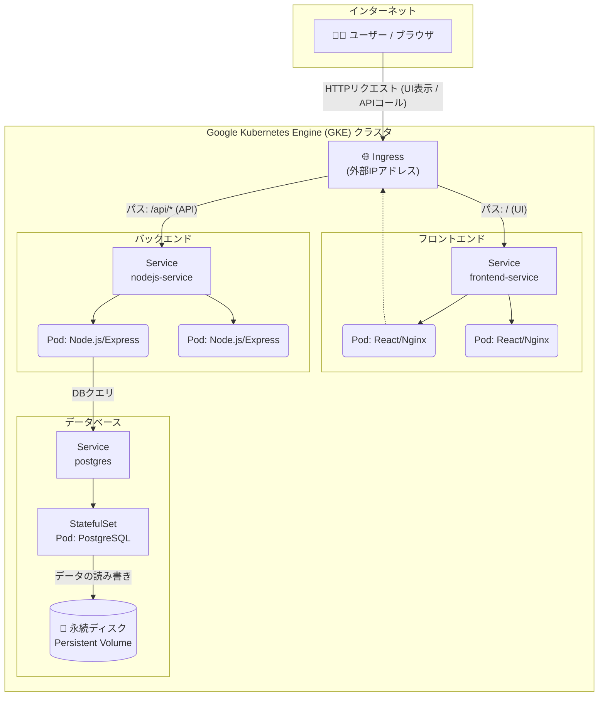

# GKEで動かすToDoアプリケーション

これは、React (Vite), Node.js (Express), PostgreSQLで構築したToDoアプリケーションを、Dockerでコンテナ化し、Google Kubernetes Engine (GKE) 上にデプロイするサンプルプロジェクトです。

Ingressによるルーティング、StatefulSetによるデータベースの永続化、そしてGKE Ingressのヘルスチェック設定など、クラウドネイティブなアプリケーションを構築する上で重要な技術を含んでいます。

## 表示画面


## ✨ 技術スタック

| カテゴリ       | 技術                                                                                                                                                                                                 |
| :------------- | :--------------------------------------------------------------------------------------------------------------------------------------------------------------------------------------------------- |
| **フロントエンド** | React.js, Vite, Axios                                                                                                                                                                                |
| **バックエンド** | Node.js, Express.js, node-postgres (pg)                                                                                                                                                              |
| **データベース** | PostgreSQL                                                                                                                                                                                           |
| **コンテナ** | Docker, Docker Hub, Dockerfile (Multi-stage build)                                                                                                                                                   |
| **デプロイ** | Kubernetes (GKE)                                                                                                                                                                            |
| **K8sリソース** | Deployment, StatefulSet, Service, Ingress, PersistentVolumeClaim, ConfigMap, Secret, BackendConfig |
| **その他** | `.gitignore`, SOPS (secretリソース暗号化)                                                                                                                                                                            |

## 構成図



## 📁 ディレクトリ構成

```
.
├── frontend/      # React (Vite) アプリケーション
├── k8s/           # Kubernetes マニフェストファイル
├── nodejs-app/    # Node.js (Express) アプリケーション
├── .gitignore
└── README.md
```

## 🚀 動かし方

### 1. リポジトリをクローン

```bash
git clone <このリポジトリのURL>
cd <リポジトリ名>
```

### 2. Secretファイルの作成

このリポジトリには、データベースのパスワードを記述した`k8s/postgres-secret.yaml`は含まれていません。以下の内容で新規作成してください。

**`k8s/postgres-secret.yaml`**:

```yaml
apiVersion: v1
kind: Secret
metadata:
  name: postgres-secret
type: Opaque
stringData:
  DB_HOST: postgres
  DB_PORT: "5432"
  DB_USER: <任意のユーザー名>
  DB_PASSWORD: <強力なパスワード>
  DB_NAME: <任意のデータベース名>
  POSTGRES_USER: <↑と同じユーザー名>
  POSTGRES_PASSWORD: <↑と同じパスワード>
  POSTGRES_DB: <↑と同じデータベース名>
```

### 3. Dockerイメージのビルドとプッシュ

フロントエンドとバックエンドのDockerイメージをビルドし、Docker Hubなどのコンテナレジストリにプッシュします。

```bash
# Docker Hub ユーザー名
export DOCKER_USERNAME=<あなたのDocker Hubユーザー名>

# バックエンド
cd nodejs-app
docker build -t $DOCKER_USERNAME/todo-app:1.0.1 .
docker push $DOCKER_USERNAME/todo-app:1.0.1
cd ..

# フロントエンド
cd frontend
docker build -t $DOCKER_USERNAME/todo-frontend:1.0.1 .
docker push $DOCKER_USERNAME/todo-frontend:1.0.1
cd ..
```

### 4. マニフェストの適用

デプロイ用のYAMLファイル内のイメージ名を、先ほどプッシュしたものに書き換えてください。（`k8s/nodejs-app-deployment.yaml` と `k8s/frontend-deployment.yaml`）

その後、すべてのマニフェストをGKEクラスタに適用します。

```bash
kubectl apply -f k8s/
```

### 5. IngressのIPアドレスを確認してアクセス

Ingressに外部IPアドレスが割り当てられるまで数分待ち（筆者は10分ほどかかりました）、IPアドレスを確認します。

```bash
kubectl get ingress
```

表示された`ADDRESS`をブラウザで開くと、アプリケーションにアクセスできます。


## 📝 ライセンス

This project is licensed under the MIT License.
